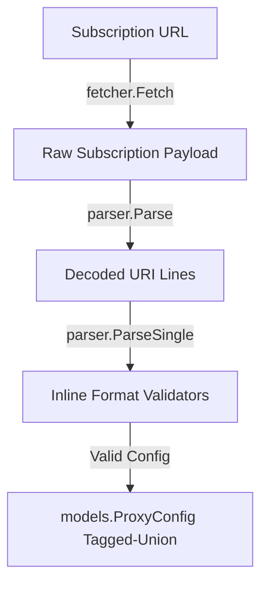

# Public Package Directory — Agent Guide

The `pkg/` directory contains VibeRay's external-facing library packages. Unlike `internal/`, packages in `pkg/` are designed to be reusable by other Go modules or CLI frontends. They have zero dependencies on other VibeRay execution packages.

## Directory Map

```
viberay/pkg/
├── fetcher/      # Remote subscription downloads (HTTP)
└── parser/       # Sniffers, base64 checkers, inline format validators, and protocol-specific parsers
```

## Package Interactions

The public packages focus strictly on resolving inputs into structured data schemas before they enter VibeRay's private testing engine:



## Scope and Principles

1. **Self-Contained Logic:** Packages under `pkg/` must not import anything from `internal/` with the exception of `internal/models` (for data structures) and `internal/errors` (for sentinel errors). This keeps the parsing and downloading libraries lightweight and decoupled.
2. **Fail-Fast Parsing:** `pkg/parser` runs strict verification (e.g. checking UUID structure, port integers, base64 public key lengths) inline during parsing. It refuses to construct configs for invalid links, preventing malformed URLs from entering the pipeline.
3. **No Network Side-Effects at Parse Time:** `pkg/parser` verifies strings but does not execute external dial actions. If a domain is unresolvable during parsing, it issues warnings rather than failing hard, as DNS servers may resolve differently when the tests execute inside the virtual private tunnel pipeline.
